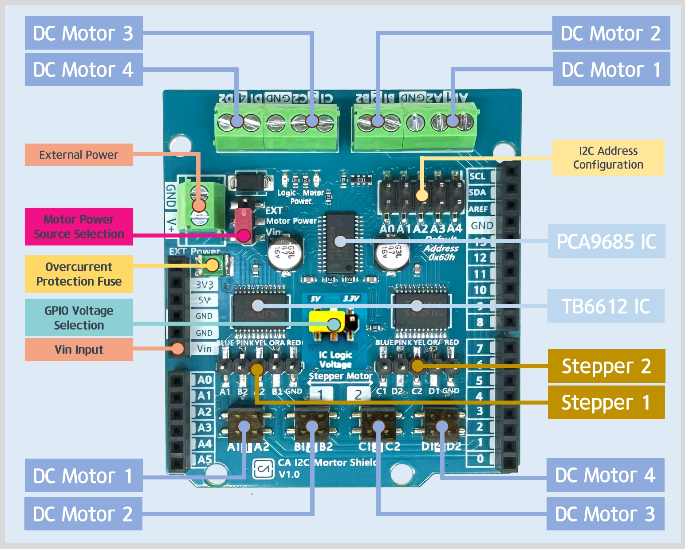

# Coding Array Motor Shield V1 Library

## Overview

The `Coding Array Motor Shield V1 Library` is based on the Adafruit Motor Shield V2, but it has been developed with the removal of dependencies on Adafruit's `Adafruit_MS_PWMServoDriver` and `Adafruit_I2CDevice`. This library supports the control of up to four DC motors or two stepper motors, excluding servo motors. It offers microstepping and stacking capabilities for DC and stepper motors, allowing for flexible application across various motor control projects.

Incorporating the `PCA9685_RT` library (by RobTillaart, version 0.7.1), it supports the PCA9685 I2C LED driver and 16-channel PWM with 12-bit resolution. This integration allows for the 16 channels to be independently configured in 1/4096 steps, enabling fine-tuning of the PWM signal's duty cycle to better than 0.1%. The PWM channels can be individually started and stopped, optimizing power distribution across multiple servos or creating special effects with RGB LEDs.

## Development Background

The `Coding Array Motor Shield V1 Library` is grounded on the `Adafruit_MotorShield v2` library from Adafruit Industries and the `PCA9685_RT` library from Rob Tillaart. It was developed to address issues encountered during DC motor operation related to I2C communication errors and changing motor rotation direction with the Adafruit_MotorShield v2 library. Such issues were particularly apparent in the `void Adafruit_MotorShield::setPin(uint8_t pin, boolean value)` function, where setting multiple pins to HIGH or LOW posed problems.

## Compatible Products

### Coding Array Motor Shield V1
url : http://www.codingarray.net

The Coding Array I2C Motor Driver Shield, a clone of the Adafruit Motor Shield V2, is specifically designed to offer a more user-friendly interface and facilitate easier wiring for enthusiasts and professionals alike. This enhancement ensures a smoother integration into projects, making it an ideal choice for those seeking convenience without compromising on functionality.

### Adafruit Motor/Stepper/Servo Shield for Arduino v2 Kit - v2.3
url : https://www.adafruit.com/product/1438

The original Adafruit Motorshield kit is one of our most beloved kits, which is why we decided to make something even better. We have upgraded the shield kit to make the bestest, easiest way to drive DC and Stepper motors. This shield will make quick work of your next robotics project! We kept the ability to drive up to 4 DC motors or 2 stepper motors, but added many improvements:

## Related Links

- Adafruit Motor Shield V2 Library: https://github.com/adafruit/Adafruit_Motor_Shield_V2_Library
- PCA9685_RT Library by RobTillaart: https://github.com/RobTillaart/PCA9685_RT

## License

This library was written by hanol JU for codingarray. It is licensed under both the BSD License and the MIT License; see the license.txt file for more information. All text above must be included in any redistribution.
